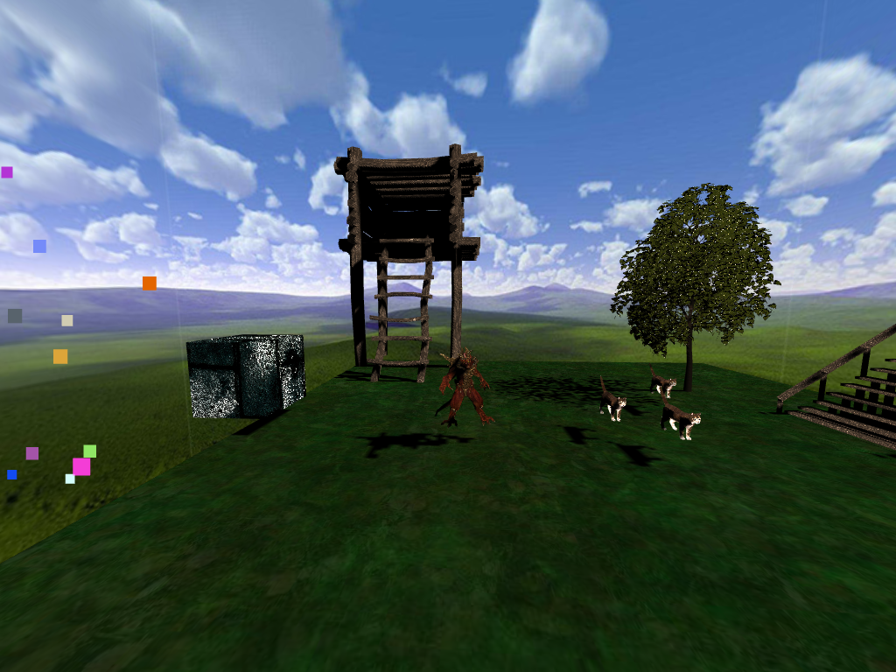
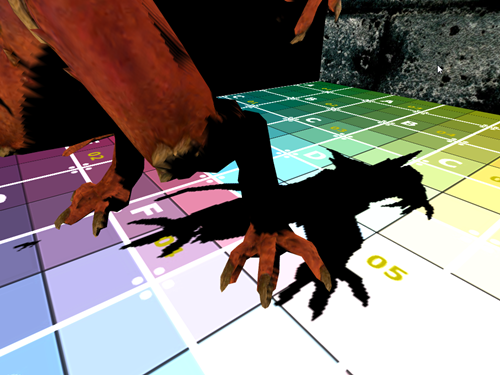
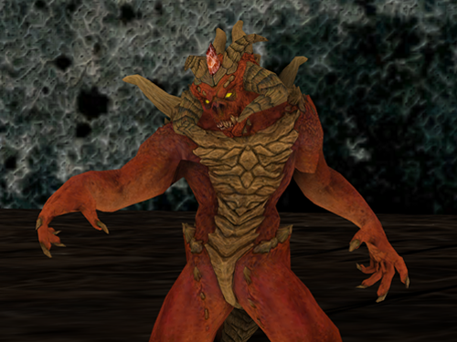

A 3D game engine written in C++ and OpenGL. Currently only supports Windows.

# [<i class="fa fa-github" aria-hidden="true"></i> View on Github](https://github.com/HarryGogonis/YAGE)

# Features

* MIT License, do whatever you want with the code!
* OpenGL-based 3D rendering pipeline
* Supports up to 500,000 polygons efficiently
* Integrated physics system (using Bullet)
* Diffuse, Normal, and Specular texture mapping
* Import scenes and meshes via .fbx, .obj, .3ds, and more (using ASSIMP)
* Game scene builder
* Interactive camera system
* Dynamic shadows and lighting
* Particle systems
* Skybox
* Much more!

# Planned Features
* Animation
* 2D Text Rendering

# Demo Game
This is a quick demo game I created to provide developers
with a understanding of what they can build with the game engine.

<iframe
  width="100%" height="500"
  src="https://www.youtube.com/embed/XEKZT7AJ788"
  frameborder="0" allowfullscreen
></iframe>

# Screenshots

## Dynamic Shadows

## Example Diablo Render

## Particle System

