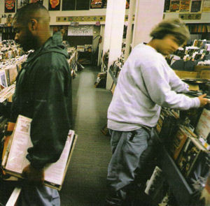

These are all albums that I consider some of the greatest albums of all time,
but is by no means a definitive list.
I consider each album to be the artists greatest work.
I will attempt to update this list as I listen to new albums.

_Albums appear in no particular order._

<section class="featured-music">
<section class="cover">

</section>
<section class="meta">
<h2 class="artist">Björk</h2>
<h2 class="album">Homogenic</h2>
1997 / Pop
</section>
</section>

<section class="featured-music">
<section class="cover">

</section>
<section class="meta">
<h2 class="artist">Moving Mountains</h2>
<h2 class="album">Pneuma</h2>
2007 / Indie Rock / Post-Hardcore
</section>
</section>

<section class="featured-music">
<section class="cover">

</section>
<section class="meta">
<h2 class="artist">Nas</h2>
<h2 class="album">Illmatic</h2>
1994 / Hip-hop
</section>
</section>

This album is widely regarded as the best hip-hop album of all time.
It was produced by one of the greatest producers of all time, [DJ Premier](https://en.wikipedia.org/wiki/DJ_Premier).

My favorite part of the album is Nas ad-lib near the beginning of the album

> I don't know how to start this shit

Then Nas proceeds to drop one of the best verses ever.

Listen: [Nas: "N.Y State of Mind"](https://www.youtube.com/watch?v=UKjj4hk0pV4)

<section class="featured-music">
<section class="cover">

</section>
<section class="meta">
<h2 class="artist">DJ Shadow</h2>
<h2 class="album">Endtroducing.....</h2>
1996 / Trip-hop
</section>
</section>

<section class="featured-music">
<section class="cover">

</section>
<section class="meta">
<h2 class="artist">Joy Divison</h2>
<h2 class="album">Unknown Pleasures</h2>
1979 / Post-punk
</section>
</section>

<section class="featured-music">
<section class="cover">

</section>
<section class="meta">
<h2 class="artist">Charles Mingus</h2>
<h2 class="album">Mingus Ah Um</h2>
1959 / Jazz
</section>
</section>

This album is one of the greatest jazz records of all time.
You can tell this album had a lot of influence on early rock and roll.

<section class="featured-music">
<section class="cover">

</section>
<section class="meta">
<h2 class="artist">Kendrick Lamar</h2>
<h2 class="album">To Pimp A Butterfly</h2>
2015 / Hip hop
</section>
</section>

This was my [favorite album of 2015](https://medium.com/@harrygogonis/my-top-10-albums-of-2015-2310ac68b5fc).
This and _Good Kid, M.A.A.D City_ are my favorite hip hop albums of all time.

<section class="featured-music">
<section class="cover">

</section>
<section class="meta">
<h2 class="artist">Elliott Smith</h2>
<h2 class="album">Either/Or</h2>
1997 / Indie Folk
</section>
</section>

<section class="featured-music">
<section class="cover">

</section>
<section class="meta">
<h2 class="artist">Burial</h2>
<h2 class="album">Untrue</h2>
2007 / Dubstep
</section>
</section>

The underground and anonymous Burial takes R&B samples and turns them into Dubstep masterpieces.
Make sure to forget any pre-conceived notions of Dubstep you have.

<section class="featured-music">
<section class="cover">

</section>
<section class="meta">
<h2 class="artist">The Antlers</h2>
<h2 class="album">Hospice</h2>
2009 / Indie Rock
</section>
</section>

_Hospice_ is a concept album that tells the [story](http://blogs.villagevoice.com/music/2009/08/interview_the_a.php) of a romance between a hospice worker and their patient who is suffering from terminal bone cancer. The album will destroy you emotionally.

The album is a meme in the indieheads community but hasn't reached [_In The Aeroplane Over the Sea_ status](http://knowyourmeme.com/memes/in-the-aeroplane-over-the-sea-cover-parodies).

<section class="featured-music">
<section class="cover">

</section>
<section class="meta">
<h2 class="artist">Animal Collective</h2>
<h2 class="album">Merriweather Post Pavilion</h2>
2009 / Psychedelic pop
</section>
</section>

<section class="featured-music">
<section class="cover">

</section>
<section class="meta">
<h2 class="artist">My Bloody Valentine</h2>
<h2 class="album">Loveless</h2>
1991 / Shoegazing
</section>
</section>

Kevin Shields is the mastermind behind _My Bloody Valentine_.
His [unique guitar techniques](https://www.youtube.com/watch?v=HsFZCRuA4Qs) create noises never heard before.
_Loveless_ took two years and £250,000 to record, and (allegedly) lead to the bankruptcy of the label.

_Loveless_ is a legendary album because it is _the_ album people think of in the shoegazing genre.

<section class="featured-music">
<section class="cover">

</section>
<section class="meta">
<h2 class="artist">Kanye West</h2>
<h2 class="album">My Beautiful Dark Twisted Fantasy</h2>
2010 / Hip hop
</section>
</section>

<section class="featured-music">
<section class="cover">

</section>
<section class="meta">
<h2 class="artist">Metallica</h2>
<h2 class="album">Master of Puppets</h2>
1986 / Thrash metal
</section>
</section>
